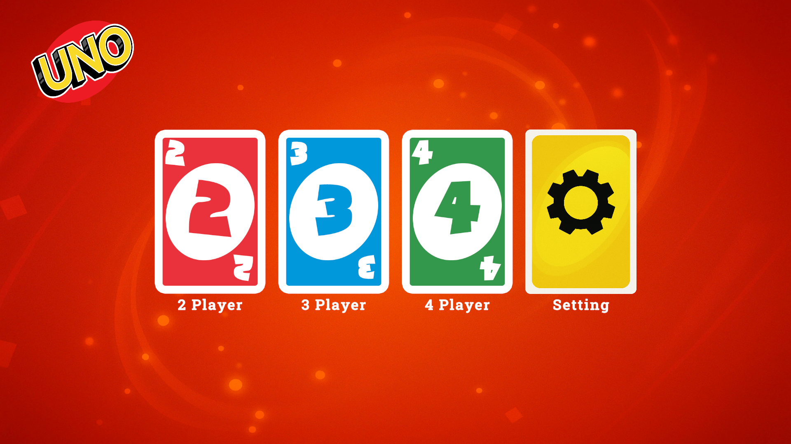
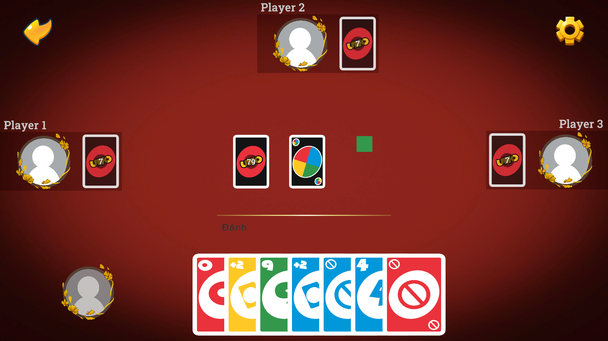
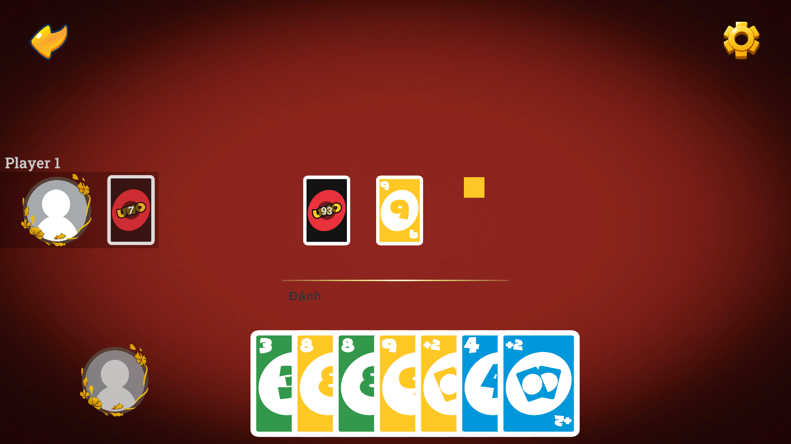

## Project: UNO - A Turn-based Card Game

## DownLoad Game
- [Download Game](https://drive.google.com/drive/folders/18lC7HeYdLNmGzrbZR_tnbNCnmHKQQoQe?usp=sharing)
- [Demo](https://youtu.be/k77Wi5AIfWw)

<!-- ABOUT THE PROJECT -->
## About The Project
UNO is a fast-paced shedding-type card game first created in 1971 by American barber Merle Robbins and now published by Mattel. It is played with a dedicated 108-card deck featuring four colored suits and special action cards such as Skip, Reverse, Draw Two, Wild and Wild Draw Four. Suitable for 2–10 players, participants take turns matching the top card of the discard pile by color or number—or deploying an action card to disrupt opponents—aiming to be the first to empty their hand and typically reach 500 points over several rounds. When a player has only one card left they must shout “UNO!” or draw a penalty, adding an extra dash of tension to every turn. Easy to learn yet strategically engaging, the game has sold millions of copies and remains a staple of family game nights around the world

### Built With

## Demo

    
    
    

## Contact

 

Gmail - vuongha16104@gmail.com

Project Link: [UNO](https://github.com/OnionSm/UNO)

